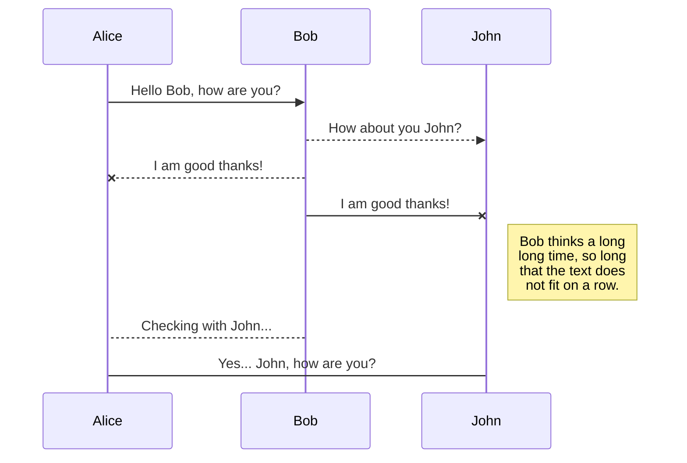
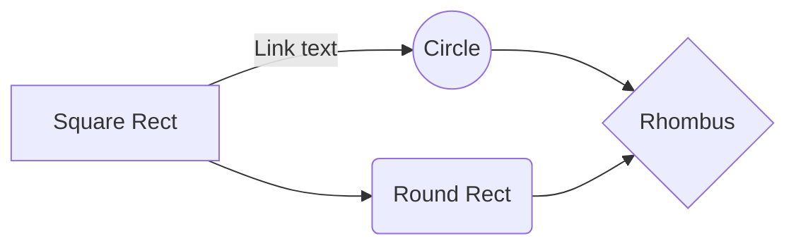

# ASINY

ASINY is a recursive acronym that means **A**SINY is  **S**ite **I**n **N**ew **Y**ork. Its goal is to provide a ranking of the best district according to the metrics customized by the user. Mainly the distances e in different means of transport.
The interface tries to prioritize the Map, but at the same time give information about the best district determined by the application.
## How to use
After loading the page the user must select a filter to prioritize the districts for example the price, for the distance it takes a while however the bar located at the top of the filters allows to see the level of data loading .

After this the table will be updated, then the user will be able to select one of the rows of the table with which the district will be shown on the map with this the user will know its location. In addition, a series of graphs to explain the price data if this filter has been selected. If the distance filter has been activated the user can see the distance of the neighborhoods to NYU by simply passing the map for each of them and if you want to see the route just enough with click on said marker and it will show the best route to NYU.

The user can also choose in each of the table the available rows that he wants to be displayed and exported (only data from previously activated filters will be loaded)

finally the user has 4 tools to make their selection that are the heat map of crimes, see galleries, districts not habitable and see museums that are located at the top.
## KeyWords

* Interactive
* asdasd
* Tables
* Near
* Intuitive 

## Datasets Used

*  **Name NBH** [[NAMESNEIGHBORHOOD](https://data.cityofnewyork.us/api/views/xyye-rtrs/rows.json?accessType=DOWNLOAD)]
	* Column Used:
		* [10]Name
		* [9]CoorCenter
		* [16]district
*  **SHAPECD** [[SHAPECD](https://services5.arcgis.com/GfwWNkhOj9bNBqoJ/arcgis/rest/services/nycd/FeatureServer/0/query?where=1=1&outFields=*&outSR=4326&f=geojson)]
	* Column Used:
		* features.geometry.coordinates
		* features.properties.BoroCD
		
	* 800 data  for consult
*  **NAMESNEIGHBORHOOD** [[NamesNB](https://data.cityofnewyork.us/api/views/xyye-rtrs/rows.json?accessType=DOWNLOAD)]
	* Column Used:
		* [10]Name
		* [9]Centroid of Neighborhood
		* [16]Borough Name
		
	* 293 pull all in one consult
	
*  **CRIMES** [[crimes](https://data.cityofnewyork.us/api/views/xyye-rtrs/rows.json?accessType=DOWNLOAD)]
	* Column Used:
		* [3]latitude
		* [20]Longitude
		* [16]Borough Name
		
	* 999 pull all in one consult
* Interactive Map
## Description

The application will seek to provide information filtered from the districts and also generate a ranking according to the parameters prioritized by the user. The interface will seek to be as intuitive as possible by responding to movements and controls commonly used in web pages containing maps.
Introduction
 -   Map View:
		1. [Y] the map starts centered at NYC University
		2. [Y] Marker in NYC University
 - Data Visualization:
		1. [Y] Highlight area of districts
		2. [Y] Table with ranking of best districts
		3. [Y] Chart transfer times from districts
 - Interaction Form:
		1. [Y]2 columns with filtered information regarding the districts
		2. [Y]Map interactive in the center
		3. [Y]Navigation bar on top to define metrics
		4. [N] Select means of transport
		5. [Y] Tables with the ranking of the districts that stand out on the map
		6. [Y] Exportable tables with  ranking
## Formulates district prioritization
To calculate the distance between Community District and NYU, the distance traveled by car from all the neighborhoods it contains to the NYU is calculated and averaged so that a more accurate measurement is obtained.
Then prioritize giving one point for each room of lower cost they have and also has the same type of prioritization for the number of rooms that has. Later it is divided by the number of houses that are counted to be more equitable.
 
# Files
 - index.html
 - style.css
 - index.js
 - [this] README.md

Here is the idea to use the mashup
	 1.  [Y] Basic Map with specific location (your map is located in a meaningful place, city of west lafayette for example)
    

-   [name] [link] [data type] [data columns used] [data amount] Please provide a name+link+basicInfo to each dataset you have used.
-   [Y/N] Do you use the primary dataset ”online climate data” from data.gov?
-   [Y/N] [List] Are all these datasets from data.gov or data.indy.gov? If not, where are they coming from (links)?

4.  Brief Description

-   Use a paragraph to introduce your project.

Fill in the structued description:

-   Map View:
    
    1.  [Y/N] Basic Map with specific location (your map is located in a meaningful place, city of west lafayette for example)
    2.  [Y/N] Markers for location of markets
    3.  [Y/N] Labels for markets' names
    4.  [Y/N] InfoWindow to show detail information of a market
    5.  [Y/N] [describe] Any other cover on the map (for example, cloud cover to show the weather effect)
-   Data Visualization:
    
    1.  [Y/N] [describe] Use Graph? What is the type? (bar chart, pie chart, radar chart ...)
    2.  [Y/N] [List] Any interaction available on the graph? List them (enable click on numbers, drag on lines, change time/variables ...)
-   Interaction Form:
    
    1.  [Y/N] [List] Any information output? list them. (text field, text area, label, plain HTML ...)
    2.  [Y/N] [List] Any operation option (filters)? List them. (search markets, search vegetables, filter based on price, sort based on convenience ...)
    3.  [Y/N] [List] Any information input? List them. (comments, markers, user preference ...)
    4.  [Y/N] [List] Interaction with Map? List them. (filter on price will affect map markers, sort on price will affect map markers, ...)
    5.  [Y/N] [List] Interaction with data visualization? List them. (filter, sort, set variables ...)

5.  Build Case How can we build and access your project on a Linux/Unix machine if you use external dependencies besides HTML/CSS/Javascript? List the dependencies you used, such as python, node.js, etc. List the steps we should follow to build the project.
    
6.  Test Case Which browsers did you test your project on? Chrome, IE, Edge, Safari, or Firefox?
    
7.  Additional information You Want to Share with Us E.g. any problems you faced/fixed, where you reached out to for help, etc.

Hi! I'm your first Markdown file in **StackEdit**. If you want to learn about StackEdit, you can read me. If you want to play with Markdown, you can edit me. If you have finished with me, you can just create new files by opening the **file explorer** on the left corner of the navigation bar.

## Awards

Este proyecto consiste en una aplicación Web que logro conectar y publicar información pública mediante un mapa para facilitar el acceso de las personas a mejores viviendas en la ciudad de Nueva York. El proyecto fue premiado debido a la facilidad de uso que tiene el aplicativo y además a la rapidez de desarrollo ya que el proyecto se culmino en tan solo 1 mes.

# Files

StackEdit stores your files in your browser, which means all your files are automatically saved locally and are accessible **offline!**

## Create files and folders

The file explorer is accessible using the button in left corner of the navigation bar. You can create a new file by clicking the **New file** button in the file explorer. You can also create folders by clicking the **New folder** button.

## Switch to another file

All your files are listed in the file explorer. You can switch from one to another by clicking a file in the list.

## Rename a file

You can rename the current file by clicking the file name in the navigation bar or by clicking the **Rename** button in the file explorer.

## Delete a file

You can delete the current file by clicking the **Remove** button in the file explorer. The file will be moved into the **Trash** folder and automatically deleted after 7 days of inactivity.

## Export a file

You can export the current file by clicking **Export to disk** in the menu. You can choose to export the file as plain Markdown, as HTML using a Handlebars template or as a PDF.

# Synchronization

Synchronization is one of the biggest features of StackEdit. It enables you to synchronize any file in your workspace with other files stored in your **Google Drive**, your **Dropbox** and your **GitHub** accounts. This allows you to keep writing on other devices, collaborate with people you share the file with, integrate easily into your workflow... The synchronization mechanism takes place every minute in the background, downloading, merging, and uploading file modifications.

There are two types of synchronization and they can complement each other:

- The workspace synchronization will sync all your files, folders and settings automatically. This will allow you to fetch your workspace on any other device.
	> To start syncing your workspace, just sign in with Google in the menu.

- The file synchronization will keep one file of the workspace synced with one or multiple files in **Google Drive**, **Dropbox** or **GitHub**.
	> Before starting to sync files, you must link an account in the **Synchronize** sub-menu.

## Open a file

You can open a file from **Google Drive**, **Dropbox** or **GitHub** by opening the **Synchronize** sub-menu and clicking **Open from**. Once opened in the workspace, any modification in the file will be automatically synced.

## Save a file

You can save any file of the workspace to **Google Drive**, **Dropbox** or **GitHub** by opening the **Synchronize** sub-menu and clicking **Save on**. Even if a file in the workspace is already synced, you can save it to another location. StackEdit can sync one file with multiple locations and accounts.

## Synchronize a file

Once your file is linked to a synchronized location, StackEdit will periodically synchronize it by downloading/uploading any modification. A merge will be performed if necessary and conflicts will be resolved.

If you just have modified your file and you want to force syncing, click the **Synchronize now** button in the navigation bar.

> **Note:** The **Synchronize now** button is disabled if you have no file to synchronize.

## Manage file synchronization

Since one file can be synced with multiple locations, you can list and manage synchronized locations by clicking **File synchronization** in the **Synchronize** sub-menu. This allows you to list and remove synchronized locations that are linked to your file.

# Publication

Publishing in StackEdit makes it simple for you to publish online your files. Once you're happy with a file, you can publish it to different hosting platforms like **Blogger**, **Dropbox**, **Gist**, **GitHub**, **Google Drive**, **WordPress** and **Zendesk**. With [Handlebars templates](http://handlebarsjs.com/), you have full control over what you export.

> Before starting to publish, you must link an account in the **Publish** sub-menu.

## Publish a File

You can publish your file by opening the **Publish** sub-menu and by clicking **Publish to**. For some locations, you can choose between the following formats:

- Markdown: publish the Markdown text on a website that can interpret it (**GitHub** for instance),
- HTML: publish the file converted to HTML via a Handlebars template (on a blog for example).

## Update a publication

After publishing, StackEdit keeps your file linked to that publication which makes it easy for you to re-publish it. Once you have modified your file and you want to update your publication, click on the **Publish now** button in the navigation bar.

> **Note:** The **Publish now** button is disabled if your file has not been published yet.

## Manage file publication

Since one file can be published to multiple locations, you can list and manage publish locations by clicking **File publication** in the **Publish** sub-menu. This allows you to list and remove publication locations that are linked to your file.

# Markdown extensions

StackEdit extends the standard Markdown syntax by adding extra **Markdown extensions**, providing you with some nice features.

> **ProTip:** You can disable any **Markdown extension** in the **File properties** dialog.

## KaTeX

You can render LaTeX mathematical expressions using [KaTeX](https://khan.github.io/KaTeX/):

The *Gamma function* satisfying $\Gamma(n) = (n-1)!\quad\forall n\in\mathbb N$ is via the Euler integral

$$
\Gamma(z) = \int_0^\infty t^{z-1}e^{-t}dt\,.
$$

> You can find more information about **LaTeX** mathematical expressions [here](http://meta.math.stackexchange.com/questions/5020/mathjax-basic-tutorial-and-quick-reference).

## UML diagrams

You can render UML diagrams using [Mermaid](https://mermaidjs.github.io/). For example, this will produce a sequence diagram:

And this will produce a flow chart:

<!--stackedit_data:
eyJoaXN0b3J5IjpbLTcxMzcxMzYzNiwtMTE5NzUxMTUyMiw3Nz
UwNDY0NDksLTE1MzAxNjI3MTMsMTE1NDgyNDM3OCw0NzEwMDM5
MDEsLTI0MTk2NzI2MSwtOTE1Mjg5NTEzLC0xNjAxMTY5NzcyLD
k2NjQ1MDcxNywxMDI0MTY5NzksLTE0NjE0OTg2NDQsLTQ5MDE5
MDQ5LDE3NDExNDIwMDUsLTE2NjE3NzU3OCwzODI2NjI3MTUsLT
U0NTA0NTM1MywxOTM4MzE3NTQ4LDQ1OTI3MjcxOSwxODY3NjM3
ODFdfQ==
-->
